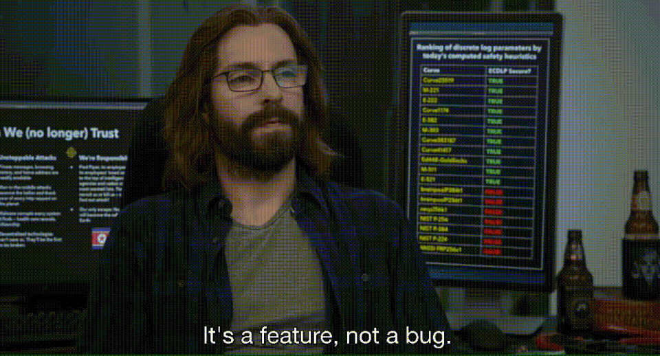

<h2>👋,Hey I'm AlenPaulVarghese.</h2>
I am working on some side projects, learning some couple new dishes.

  

<h2>⚡️ A Few Quick Facts</h2>
<ul>
<li>🌱 Learning <strong>python and rust</strong>.</li>
<li>👨‍💻 Some of my <strong>projects</strong> are available on <a href="https://gitlab.com/alenpaul2001">Gitlab</a>.</li>
<li>🦹 Favourite super villain <a href="https://en.wikipedia.org/wiki/Eobard_Thawne"><strong>Reverse Flash</strong></a>.</li>
<li>⚡ Fun fact: I consume a lot of <strong>Caffeine ☕</strong>.</li>
</ul>
<h2>🚀 Some Tools I Use</h2>

