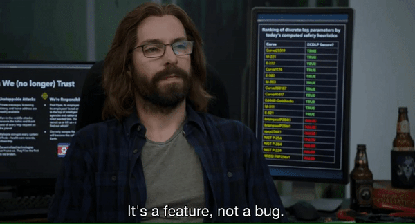

<h1>Welcome earthlings.</h1>

Dual-wielding Python and Rust, warding off unsafe foes.

<h2>⚡️ A Few Quick Facts</h2>
<ul>
    <li>🌱 Learning <a href="https://www.python.org/"><strong>Python</strong></a> and <a
            href="https://www.rust-lang.org/"><strong>Rust</strong></a>.</li>
    <li>👨‍💻 Some of my projects are available on <a
            href="https://gitlab.com/alenpaulvarghese"><strong>Gitlab</strong></a>.</li>
    <li>🦹 Favourite super villain <a href="https://en.wikipedia.org/wiki/Eobard_Thawne"><strong>Reverse
                flash</strong></a>.
    </li>
    <li>⚡ Fun fact: I consume a lot of <a href="https://en.wikipedia.org/wiki/Caffeine"><strong>Caffeine </a></strong>☕.
    </li>
</ul>
